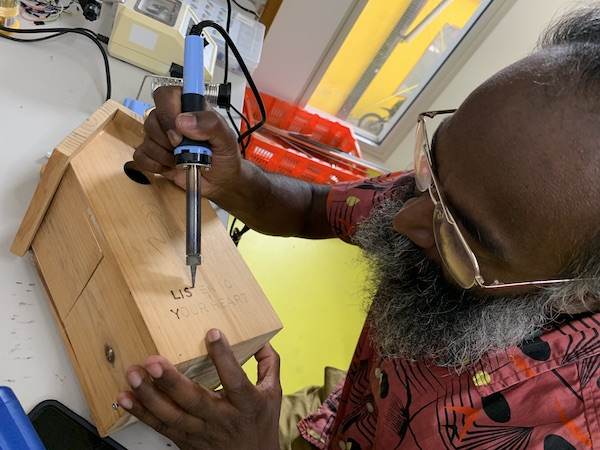

# heartbeater

Arduino project recording a heartbeat using a Max20300 sensor and playing it back using a solenoid.
All done quick 'n dirty, use at your own risk.

Made during the [Heartbits workshop](https://hackersanddesigners.nl/s/Summer_Academy_2019/p/Heart_bits) by Andrea Valliere, Ana Jeličić, Jonas Bohatsch during HDSA2019. 



## Getting Started

### Prerequisites

The things you need:

* Arduino Uno
* Max20300 heartbeat sensor
* 5V Solenoid

### Installation

Install [MAX30100_PulseOximeter](https://github.com/oxullo/Arduino-MAX30100).

```
SCL -> A5
SDA -> A4

Solenoid connected to pin 12 and GND
```


## License

[CC4r](https://constantvzw.org/wefts/cc4r.en.html)


